# Artfactory Sandbox (& Cache)  - Quick & Dirty "One-Off" Scripts To Download Complete Artwork Layers for ("On-Blockchain") Collections for Easy (Re)use ("Off-Blockchain")


## "Right-Click & Save This" Spritesheets  - What's News?


Aliens vs Punks (in 24×24px) 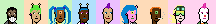
Chi Chis (in 32×32px) 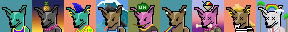
Chopper (in 24×24px)  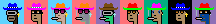
Dank Punks (in 24×24px)  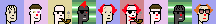


### Aliens vs Punks (in 24×24px)

Samples:

- Solid Pink, Jacket Grey, Blue Alien Girl, Red Kerchief, Blue Buzz Cut, Brown, Pink Tiara
- Solid Blue, Olive Guy, Orange Collar, Face Mask, Yellow Ponytail, Green, Long Green
- Solid Green, Jacket  White, Purple Alien Girl, Pink Collar, Neutral, Pink Bob, Sunset Shades


4x:

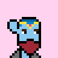
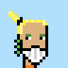
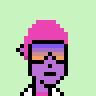


[226 Attributes (incl. Nones) in 10 Categories](aliensvspunks/spritesheet-24x24.csv):


### Chi Chis (in 32×32px)

Samples:
- Wave, Magenta, Jersey,  Lightning Bolt Earrings, Cbd Cig, Aviators, Beanie
- Palms, Silver, Suit, Simple Day, Smile, Xx, Rainbow
- Chichi Phunk


4x:

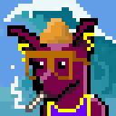
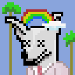


[94 Attributes (incl. Blanks) in 7 Categories (incl. 1/1s)](chichis/spritesheet-32x32.csv):


### Chopper (in 24×24px)

Samples:

- SOLID BLUE,  AQUA, HAT 22, SMOKER, 3D, BANANA
- SOLID GOLD, AP3, HAT CHOPPER, NON-SMOKER, BIG SHADES, GOLDEN
- SOLID BLACK, MIDNIGHT, HAT 10, SMOKER, CLASSIC SHADES, DIAMOND CROSS


4x:

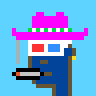
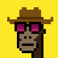
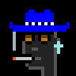


[62 Attributes in 6 Categories](chopper/spritesheet-24x24.csv):


### Dank Punks (in 24×24px)

Samples:

- Night Vibe, Pale, Clown Nose, Red Punk, Green Clown
- Contrast, Tan, Black Hair, 3D Glasses
- Golden Phunk


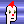
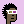
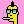

4x:


[77 Attributes (incl. Nones) in 7 Categories (plus 1/1s)](dankpunks/spritesheet-24x24.csv):


Note:  Some attributes are animations in gifs
in the "on-blockchain" version  - this "off-blockchain" remake uses
the first animation frame in gifs
to convert to a "static" attribute in the .png format.


### Edge Punks (in 24×24px)

Samples:

- Pink, Dark Green Lizard, Dark Robe, Monster Mouth, Bat, Laser Eyes
- Pink, Purple Body, Dark Suit, Smile, Dark Hair, Dark Shades
- Anatomy Of An Icon

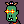

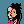

4x:

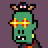
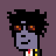


[120 Attributes (incl. Nones/Blanks) in 5 Categories (plus 1/1s)](edgepunks/spritesheet-24x24.csv):


### Fuks (in 24×24px)


Samples:

- Robot Fuk, Shaved, Purple Hair, Nose, Vape, VR, No Earrings, Diamond Chain
- Undead Fuk, Shaved, Messy Hair, Nose, Smile, Laser, Diamond Stud, Silver Chain
- Human Fuk, Chin Strap, Fast Food Cap, Nose, Grin, Nerd Glasses, No Earrings, No Chains

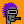
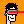
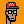

4x:


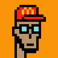


[69 Attributes in 8 Categories](fuks/spritesheet-24x24.csv):


### Inverse Punks (in 24×24px)

Samples:

- Inverted V2, Alien, Pimple, Cap Forward, Eyes, Bubble Gum, White Gold Chain, Gold Earring
- Inverted V2, Alien, Clear, Knitted Cap, VR, White Gold Chain, Gold Earring
- Inverted V2, Ape, Clear, Bandana, Classic Shades, Blue Medical Mask, Pink Sapphire Necklace


4x:


[99 Attributes in 8 Categories](inversepunks/spritesheet-24x24.csv):


### Mad Camels (in 32×32px)

Samples:

-  Cream, Zombie, Purple Cap, Earring Gold, Cool Glasses, Bubble Gum
-  Purple,  Default, Thief Hat, Green Glasses, Bowtie, Pipe
-  Green, Alien, Red Cap, Earring Gold, Laser Eye


4x:


[78 Attributes (incl. Nones) in 8 Categories](madcamels/spritesheet-32x32.csv):


### Marcs (in 24×24px)

Samples:

- Deal With It Devil
- Marc 4, Frumpy Hair, Green Shirt, Lasers, Cigarette
- Zombie, Green Eyes, Wild Hair, Mustache, Polarized


4x:


[171 Attributes (incl. Nones) in 11 Categories (plus 1/1s)](marcs/spritesheet-24x24.csv):


### NFL (in 23×23px)

Samples:

- Justin Fields
- Turf, Bot, Oakland, 13, Full Beard Light
- Goal Line, Base 5, Atlanta, 7, Full Beard Black


4x:


[136 Attributes (incl. Nones) in 6 Categories (plus 1/1s)](nfl/spritesheet-23x23.csv):


### Nomads (in 24×24px)

Samples:

-  Plain, Male 6, Laser, No Really No Mad, Mohawkin
-  Dark Plain, Male 2, Purple, No Really No Mad, Basement Dwellin
-  Over The Rainbow Bridge For Nomad Bridge, Male 4, Purple, I AM NOT F ING MAD, Mohawkin


4x:


[65 Attributes (incl. Nones) in 5 Categories (plus 1/1s)](nomads/spritesheet-24x24.csv):


Note:  Some backgrounds (from chain runners) are in 32×32px - CANNOT
 "downsampled" loss-free to 24×24px  - that's a "classic faux-pixel art" bug.


### Phunk Ape Origins (in 24×24px)


Samples:

- Blue 3, Chimpanzee 1, Arrow, Snow Visor, Tooth Plug, Diamond Chain
- Blue 5, Silver Back, Wild Monkey Hair, Focused, Silver Dangle, Gold Chain, Cigar
- Blue 1,  Yeti, Royal Crown, Matrix Shades, Silver Stud, Tooth Necklace, Tooth


4x:


[114 Attributes (incl. Nones) in 8 Categories](phunkapeorigins/spritesheet-24x24.csv):


### Proof of Pepe (in 48×48px)

Samples:

- Creature Pepe
- Pale Green, Sonoran Desert Toad 10, Lips Happy, Enjoyoor Hoodie, Cry, Clown Nose, Pipe
- Pale Pink, Beeping Froglet 11, Lips Smug, Enjoyoor Hoodie, Happy, Aviators Cap, Clown Nose, Sunglasses


4x:


[227 Attributes (incl. Nones) in 10 Categories (plus 1/1s)](proofofpepe/spritesheet-48x48.csv):


### Punk Apes Yacht Club (in 24×24px)


Samples:

- Solid Gray, Black, Prison Jumpsuit, Top Hat, Green Eye Shadow, Cigarette With Hot Lipstick, Silver Loop
- Solid Orange, Trippy, Biker Vest, Silver Chain, Pink With Hat, Clown Eyes Green, Frown, Silver Stud
- Solid Purple, Zombie, Tanktop, Orange Side, 3D Glasses, Frown


4x:


[170 Attributes (incl. Nones) in 14 Categories](punkapesyachtclub/spritesheet-24x24.csv):


### Punkin Spicies (in 24×24px)


Samples:

- Wine Soaked Sky, Frankensteins Monster, Bride, Choker, Vape, Bloodtears, Mole, Hoopearring
- Wine Soaked Sky, Demon, Darkhair, Goldchain, Knife, Hoopearring
- Wine Soaked Sky, Jack O Lantern, Bride, Bloodtears


4x:


[113 Attributes (incl. Nones) in 9 Categories](punkinspicies/spritesheet-24x24.csv):


## Getting Started w/ the Art Factory Gem

Yes, you can!  (Re)use the "off-blockchain" (pixel) artwork
spritesheets to generate any combination using text-to-image prompts.


Example - Let's try the Aliens vs Punks using the [**Art Factory machinery »**](https://github.com/learnpixelart/pixelart/tree/master/artfactory)

``` ruby
require 'artfactory'

# step 1 - setup the art factory;
#    pass-in the spritesheet image & (meta) dataset and
#    the format (e.g. 24x24px)

aliensvsspunks = Artfactory.read( 'aliensvspunks/spritesheet-24x24.png',
                                  'aliensvspunks/spritesheet-24x24.csv',
                                  width: 24,
                                  height: 24)


# step 2 - generate images via text (prompts)

specs = [
  ## no.37
  ['Solid Pink', 'Jacket : Grey', 'Blue Alien Girl', 'Red Kerchief',
   'Blue Buzz Cut', 'Brown', 'Pink Tiara'],
  ## no.28
  ['Solid Blue', 'Olive Guy', 'Orange Collar', 'Face Mask',
   'Yellow Ponytail', 'Green', 'Long Green'],
  ## no.21
  ['Solid Green', 'Jacket : White', 'Purple Alien Girl', 'Pink Collar', 'Neutral',
   'Pink Bob', 'Sunset Shades'],
]


specs.each_with_index do |attributes, i|
   img = aliensvsspunks.generate( *attributes )
   img.save( "aliensvspunks#{i}.png" )
   img.zoom(4).save( "aliensvspunks#{i}@4x.png" )
end
```

Voila!


4x:


Let's try the Edge Punks:

``` ruby
edgepunks = Artfactory.read( 'edgepunks/spritesheet-24x24.png',
                             'edgepunks/spritesheet-24x24.csv',
                             width: 24,
                             height: 24)

specs = [
# no.282
  ['Pink', 'Dark Green Lizard', 'Dark Robe', 'Monster Mouth', 'Bat', 'Laser Eyes'],
# no.468
  ['Pink', 'Purple Body', 'Dark Suit', 'Smile', 'Dark Hair', 'Dark Shades'],
# no.678 (1/1)
  ['Anatomy Of An Icon'],
]


specs.each_with_index do |attributes, i|
   img = edgepunks.generate( *attributes )
   img.save( "edgepunks#{i}.png" )
   img.zoom(4).save( "edgepunks#{i}@4x.png" )
end
```

Voila!


4x:


Let's try the Chi Chis:

``` ruby
chichis = Artfactory.read( 'chichis/spritesheet-32x32.png',
                           'chichis/spritesheet-32x32.csv',
                             width: 32,
                             height: 32)

specs = [
  ## no.15
  ['Wave', 'Magenta', 'Jersey',  'Lightning Bolt Earrings',
    'Cbd Cig', 'Aviators', 'Beanie'],
  ## no.8
  ['Palms', 'Silver', 'Suit', 'Simple Day', 'Smile', 'Xx', 'Rainbow'],
  ## 1/1
  ['Chichi Phunk'],
]

specs.each_with_index do |attributes, i|
   img = chichis.generate( *attributes )
   img.save( "chichis#{i}.png" )
   img.zoom(4).save( "chichis#{i}@4x.png" )
end
```

Voila!


4x:


## Questions? Comments?

Post them on the [D.I.Y. Punk (Pixel) Art reddit](https://old.reddit.com/r/DIYPunkArt). Thanks.


