# Artfactory Sandbox (& Cache)  - Quick & Dirty "One-Off" Scripts To Download Complete Artwork Layers for ("On-Blockchain") Collections for Easy (Re)use ("Off-Blockchain")

## "Right-Click & Save This" Spritesheets  - What's News?

")
")
")

### Aliens vs Punks (in 24×24px)

")

[226 Attributes (incl. Nones) in 10 Categories](aliensvspunks/spritesheet-24x24.csv):

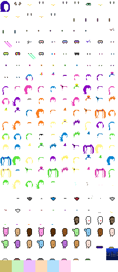

### Chi Chis (in 32×32px)

")

[94 Attributes (incl. Blanks) in 7 Categories (incl. 1/1s)](chichis/spritesheet-32x32.csv):

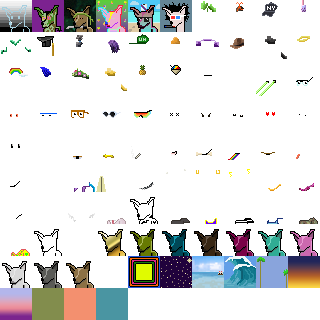

### Chopper (in 24×24px)

")

[62 Attributes in 6 Categories](chopper/spritesheet-24x24.csv):

### Dank Punks (in 24×24px)

")

[77 Attributes (incl. Nones) in 7 Categories (plus 1/1s)](dankpunks/spritesheet-24x24.csv):

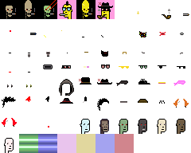

Note:  Some attributes are animations in gifs
in the "on-blockchain" version  - this "off-blockchain" remake uses
the first animation frame in gifs
to convert to a "static" attribute in the .png format.

### Edge Punks (in 24×24px)

")

[120 Attributes (incl. Nones/Blanks) in 5 Categories (plus 1/1s)](edgepunks/spritesheet-24x24.csv):

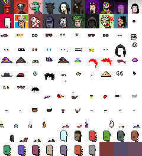

### Fuks (in 24×24px)

")

[69 Attributes in 8 Categories](fuks/spritesheet-24x24.csv):

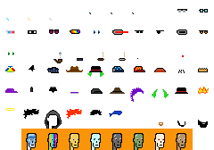

### Inverse Punks (in 24×24px)

Samples:

- Inverted V2, Alien, Pimple, Cap Forward, Eyes, Bubble Gum, White Gold Chain, Gold Earring
- Inverted V2, Alien, Clear, Knitted Cap, VR, White Gold Chain, Gold Earring
- Inverted V2, Ape, Clear, Bandana, Classic Shades, Blue Medical Mask, Pink Sapphire Necklace

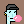
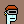

4x:

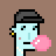

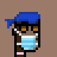

[99 Attributes in 8 Categories](inversepunks/spritesheet-24x24.csv):

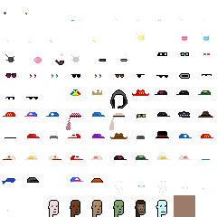

### Mad Camels (in 32×32px)

Samples:

-  Cream, Zombie, Purple Cap, Earring Gold, Cool Glasses, Bubble Gum
-  Purple,  Default, Thief Hat, Green Glasses, Bowtie, Pipe
-  Green, Alien, Red Cap, Earring Gold, Laser Eye

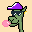

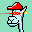

4x:

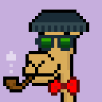

[78 Attributes (incl. Nones) in 8 Categories](madcamels/spritesheet-32x32.csv):

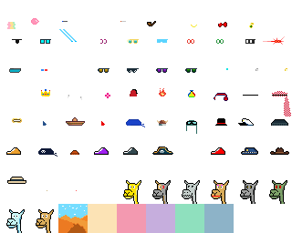

### Marcs (in 24×24px)

Samples:

- Deal With It Devil
- Marc 4, Frumpy Hair, Green Shirt, Lasers, Cigarette
- Zombie, Green Eyes, Wild Hair, Mustache, Polarized

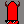
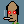
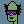

4x:

[171 Attributes (incl. Nones) in 11 Categories (plus 1/1s)](marcs/spritesheet-24x24.csv):

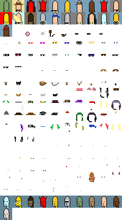

### NFL (in 23×23px)

Samples:

- Justin Fields
- Turf, Bot, Oakland, 13, Full Beard Light
- Goal Line, Base 5, Atlanta, 7, Full Beard Black

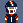
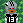
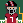

4x:

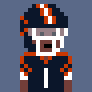
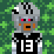

[136 Attributes (incl. Nones) in 6 Categories (plus 1/1s)](nfl/spritesheet-23x23.csv):

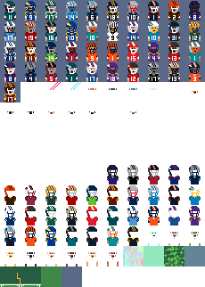

### Nomads (in 24×24px)

Samples:

-  Plain, Male 6, Laser, No Really No Mad, Mohawkin
-  Dark Plain, Male 2, Purple, No Really No Mad, Basement Dwellin
-  Over The Rainbow Bridge For Nomad Bridge, Male 4, Purple, I AM NOT F ING MAD, Mohawkin

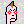
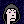
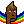

4x:

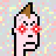

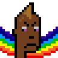

[65 Attributes (incl. Nones) in 5 Categories (plus 1/1s)](nomads/spritesheet-24x24.csv):

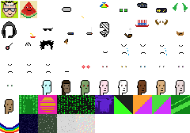

Note:  Some backgrounds (from chain runners) are in 32×32px - CANNOT
 "downsampled" loss-free to 24×24px  - that's a "classic faux-pixel art" bug.

### Phunk Ape Origins (in 24×24px)

Samples:

- Blue 3, Chimpanzee 1, Arrow, Snow Visor, Tooth Plug, Diamond Chain
- Blue 5, Silver Back, Wild Monkey Hair, Focused, Silver Dangle, Gold Chain, Cigar
- Blue 1,  Yeti, Royal Crown, Matrix Shades, Silver Stud, Tooth Necklace, Tooth

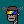
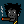

4x:

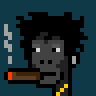
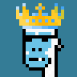

[114 Attributes (incl. Nones) in 8 Categories](phunkapeorigins/spritesheet-24x24.csv):

### Proof of Pepe (in 48×48px)

Samples:

- Creature Pepe
- Pale Green, Sonoran Desert Toad 10, Lips Happy, Enjoyoor Hoodie, Cry, Clown Nose, Pipe
- Pale Pink, Beeping Froglet 11, Lips Smug, Enjoyoor Hoodie, Happy, Aviators Cap, Clown Nose, Sunglasses

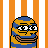

4x:

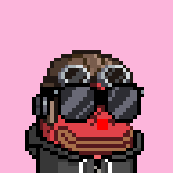

[227 Attributes (incl. Nones) in 10 Categories (plus 1/1s)](proofofpepe/spritesheet-48x48.csv):

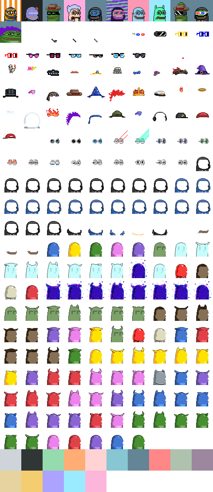

### Punk Apes Yacht Club (in 24×24px)

Samples:

- Solid Gray, Black, Prison Jumpsuit, Top Hat, Green Eye Shadow, Cigarette With Hot Lipstick, Silver Loop
- Solid Orange, Trippy, Biker Vest, Silver Chain, Pink With Hat, Clown Eyes Green, Frown, Silver Stud
- Solid Purple, Zombie, Tanktop, Orange Side, 3D Glasses, Frown

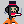
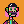
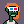

4x:

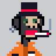

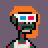

[170 Attributes (incl. Nones) in 14 Categories](punkapesyachtclub/spritesheet-24x24.csv):

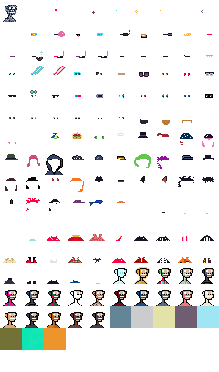

### Punkin Spicies (in 24×24px)

Samples:

- Wine Soaked Sky, Frankensteins Monster, Bride, Choker, Vape, Bloodtears, Mole, Hoopearring
- Wine Soaked Sky, Demon, Darkhair, Goldchain, Knife, Hoopearring
- Wine Soaked Sky, Jack O Lantern, Bride, Bloodtears

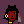
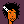

4x:

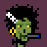
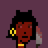

[113 Attributes (incl. Nones) in 9 Categories](punkinspicies/spritesheet-24x24.csv):

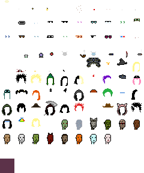

## Questions? Comments?

Post them over at the [Help & Support](https://github.com/geraldb/help) page. Thanks.

