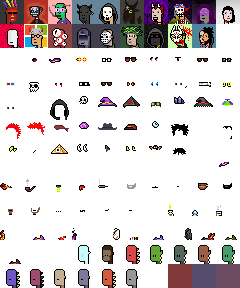

# Artfactory Sandbox (& Cache)  - Quick & Dirty "One-Off" Scripts To Download Complete Artwork Layers for ("On-Blockchain") Collections for Easy (Re)use ("Off-Blockchain")


Yes, you can!  (Re)use the "off-blockchain" (pixel) artwork
spritesheets to generate any combination using text-to-image prompts.


Example - Using the [**Art Factory machinery »**](https://github.com/learnpixelart/pixelart/tree/master/artfactory)

``` ruby
require 'artfactory'

# step 1 - setup the art factory;
#    pass-in the spritesheet image & (meta) dataset and
#    the format (e.g. 24x24px)

aliensvsspunks = Artfactory.read( './aliensvspunks/spritesheet-24x24.png',
                                  './aliensvspunks/spritesheet-24x24.csv',
                                  width: 24,
                                  height: 24)


# step 2 - generate images via text (prompts)

specs = [
  ## no.37
  ["Solid Pink", "Jacket : Grey", "Blue Alien Girl", "Red Kerchief",
   "Blue Buzz Cut", "Brown", "Pink Tiara"],
  ## no.28
  ["Solid Blue", "Olive Guy", "Orange Collar", "Face Mask",
   "Yellow Ponytail", "Green", "Long Green"],
  ## no.21
  ["Solid Green", "Jacket : White", "Purple Alien Girl", "Pink Collar", "Neutral",
   "Pink Bob", "Sunset Shades"],
]


specs.each_with_index do |attributes, i|
   img = aliensvsspunks.generate( *attributes )
   img.save( "./tmp/aliensvspunks#{i}.png" )
   img.zoom(4).save( "./tmp/aliensvspunks#{i}@4x.png" )
end
```

Voila!


4x:


## Spritesheet (Attributes) - What's News?


Example - Aliens vs Punks (in 24x24px)  - 226 Attributes (incl. Nones) in 10 Categories  ([aliensvspunks/spritesheet-24x24.csv](aliensvspunks/spritesheet-24x24.csv))


Example - Edge Punks (in 24x24px) - ([edgepunks/spritesheet-24x24.csv](edgepunks/spritesheet-24x24.csv))





## Questions? Comments?

Post them on the [D.I.Y. Punk (Pixel) Art reddit](https://old.reddit.com/r/DIYPunkArt). Thanks.


