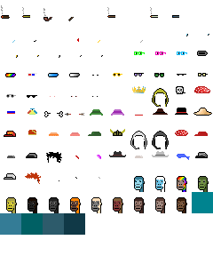

# Artfactory Sandbox (& Cache)  - Quick & Dirty "One-Off" Scripts To Download Complete Artwork Layers for ("On-Blockchain") Collections for Easy (Re)use ("Off-Blockchain")

## "Right-Click & Save This" Spritesheets  - What's News?

### Aliens vs Punks (in 24×24px)

")

[226 Attributes (incl. Nones) in 10 Categories](aliensvspunks/spritesheet-24x24.csv):

### Chi Chis (in 32×32px)

")

[94 Attributes (incl. Blanks) in 7 Categories (incl. 1/1s)](chichis/spritesheet-32x32.csv):

### Chopper (in 24×24px)

")

[62 Attributes in 6 Categories](chopper/spritesheet-24x24.csv):

### Dank Punks (in 24×24px)

")

[77 Attributes (incl. Nones) in 7 Categories (plus 1/1s)](dankpunks/spritesheet-24x24.csv):

Note:  Some attributes are animations in gifs
in the "on-blockchain" version  - this "off-blockchain" remake uses
the first animation frame in gifs
to convert to a "static" attribute in the .png format.

### Edge Punks (in 24×24px)

")

[120 Attributes (incl. Nones/Blanks) in 5 Categories (plus 1/1s)](edgepunks/spritesheet-24x24.csv):

### Fuks (in 24×24px)

")

[69 Attributes in 8 Categories](fuks/spritesheet-24x24.csv):

### Inverse Punks (in 24×24px)

[99 Attributes in 8 Categories](inversepunks/spritesheet-24x24.csv):

### Mad Camels (in 32×32px)

")

[78 Attributes (incl. Nones) in 8 Categories](madcamels/spritesheet-32x32.csv):

### Marcs (in 24×24px)

")

[171 Attributes (incl. Nones) in 11 Categories (plus 1/1s)](marcs/spritesheet-24x24.csv):

### NFL (in 23×23px)

")

[136 Attributes (incl. Nones) in 6 Categories (plus 1/1s)](nfl/spritesheet-23x23.csv):

### Nomads (in 24×24px)

[65 Attributes (incl. Nones) in 5 Categories (plus 1/1s)](nomads/spritesheet-24x24.csv):

Note:  Some backgrounds (from chain runners) are in 32×32px - CANNOT
 "downsampled" loss-free to 24×24px  - that's a "classic faux-pixel art" bug.

### Phunk Ape Origins (in 24×24px)

[114 Attributes (incl. Nones) in 8 Categories](phunkapeorigins/spritesheet-24x24.csv):

### Proof of Pepe (in 48×48px)

[227 Attributes (incl. Nones) in 10 Categories (plus 1/1s)](proofofpepe/spritesheet-48x48.csv):

### Punk Apes Yacht Club (in 24×24px)

[170 Attributes (incl. Nones) in 14 Categories](punkapesyachtclub/spritesheet-24x24.csv):

### Punkin Spicies (in 24×24px)

[113 Attributes (incl. Nones) in 9 Categories](punkinspicies/spritesheet-24x24.csv):

### And Many More Collections

See [**more »**](more)

## Questions? Comments?

Post them over at the [Help & Support](https://github.com/geraldb/help) page. Thanks.

