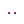

# Layers in /chopper

By image format (mime type):
- image/png _(62)_

**0** -  BANANA · GOLDEN · DIAMOND · GOLD CROSS · DIAMOND CROSS  _(5)_  
 
 
 
 
 

**1** -  VR RAINBOW · PURPLE EYE SHADOW · CLOWN EYES BLUE · CLASSIC SHADES · NERD GLASSES · 3D · STUNNAS · BIG SHADES · VR · CHOPPER  _(10)_  
 
 
 
 
 
 
 
 
 
 

**2** -  SMOKER · NON-SMOKER  _(2)_  
 
 

**3** -  RAINBOW · HAT 36 · PILOT · HOODIE · HAT 29 · BEANIE · TASSLE · HAT 12 · KNITTED CAP · PINK CAP · HAT 20 · HAT 2 · HEADBAND · HAT 17 · HAT 1 · WILD BLONDE · CAP · HAT 8 · HAT 22 · WILD WHITE · HAT 30 · HAT 26 · HAT 16 · HAT 10 · CHOPPER  _(25)_  
 
 
 
 
 
 
 
 
 
 
 
 
 
 
 
 
 
 
 
 
 
 
 
 
 

**4** -  RAINBOW · OCK · ZOMBIE · GOLD · ALI3N · ALIEN · ATOMIC · ZOMBI3 · AQUA · MIDNIGHT · PORCELAIN · COFFEE · AP3 · CHOPP3R  _(14)_  
 
 
 
 
 
 
 
 
 
 
 
 
 
 

**5** -  PURPLE · MINT · PEACH · BLUE · GOLD · BLACK  _(6)_  
 
 
 
 
 
 

