# Layers in /cherrynouns

**0** -  Accessory Body Gradient Dawn · Accessory Body Gradient Checkerdisco · Accessory Bling Scissors · Accessory Bling Sparkles · Accessory Bling Rings · Accessory Bling Mask · Accessory Bling Love · Accessory Bling Gold Ingot · Accessory Bling Cheese · Accessory Bling Arrow · Accessory Bling Anchor · Accessory Bling Anvil · Accessory Bird Side · Accessory Bird Flying · Accessory Belly Chameleon · Accessory Axe · Accessory Decay Pride · Accessory Aardvark · Accessory 1 N · Accessory Cow · Accessory Decay Gray Dark · Accessory Collar Sunset · Accessory Clover · Accessory Cloud · Accessory Chicken · Accessory Checkers Magenta 80 · Accessory Checkers Blue · Accessory Checkers Black · Accessory Checkers Big Green · Accessory Checkers Big Red Cold · Accessory Checker Spaced White · Accessory Checker Vibrant · Accessory Checker Spaced Black · Accessory Checker RGB · Accessory Checker Bigwalk Rainbow · Accessory Checker Bigwalk Greylight · Accessory Checker Bigwalk Blue Prime · Accessory Chain Logo · Accessory Carrot · Accessory Body Gradient Sunset · Accessory Body Gradient Redpink · Accessory Body Gradient Pride · Accessory Body Gradient Ice · Accessory Body Gradient Glacier · Accessory Body Gradient Dusk  _(45)_  
 
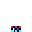 
 
 
 
 
 
 
 
 
 
 
 
 
 
 
 
 
 
 
 
 
 
 
 
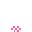 
 
 
 
 
 
 
 
 
 
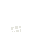 
 
 
 
 
 
 
 
 
 

**1** -  Glasses Square Watermelon · Glasses Square Yellow Orange Multi · Glasses Square Pink Purple Multi · Glasses Square Teal · Glasses Square Smoke · Glasses Square Red · Glasses Square Orange · Glasses Square Yellow Saturated · Glasses Square Magenta · Glasses Square Honey · Glasses Square Guava · Glasses Square Grey Light · Glasses Square Green Blue Multi · Glasses Square Fullblack · Glasses Hip Rose · Glasses Square Frog Green · Glasses Square Blue · Glasses Square Blue Med Saturated · Glasses Square Black · Glasses Square Black Rgb · Glasses Square Black Eyes Red  _(21)_  
 
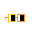 
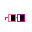 
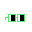 
 
 
 
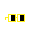 
 
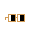 
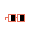 
 
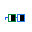 
 
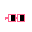 
 
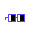 
 
 
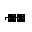 
 

**2** -  Head Cherry  _(1)_  
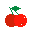 

**3** -  Body Gold · Body Cold · Body Red · Body Peachy A · Body Bege Bsod · Body Blue Sky · Body Bluegrey · Body Bege Crt · Body Computerblue · Body Darkbrown · Body Darkpink · Body Foggrey · Body Redpinkish · Body Green · Body Magenta · Body Orange Yellow · Body Peachy B · Body Orange · Body Purple · Body Rust · Body Slimegreen · Body Teal Light · Body Teal · Body Yellow · Body Grayscale 1 · Body Grayscale 7 · Body Grayscale 9 · Body Grayscale 8 · Body Gunk · Body Hotbrown  _(30)_  
 
 
 
 
 
 
 
 
 
 
 
 
 
 
 
 
 
 
 
 
 
 
 
 
 
 
 
 
 
 

**4** -  Background 05 · Background 01 · Background 02 · Background 03 · Background 04 · Background 06 · Background 07 · Background 08 · Background 09 · Background 10 · Background 11 · Background 12 · Background 13 · Background 14 · Background 15  _(15)_  
 
 
 
 
 
 
 
 
 
 
 
 
 
 
 

