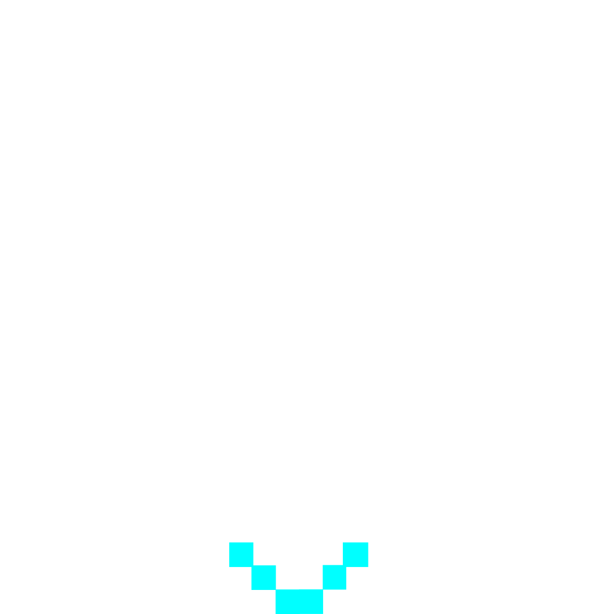

# Layers in /cutekevin

By image format (mime type):
- image/svg+xml _(60)_

**0** -  Crown · Farmers Hat · Aqua Mohawk · Pink Mohawk · Black Top Hat · Maroon Cap · Red Mohawk · Blue Cap · Orange Cap · No Hat  _(10)_  
 
 
 
 
 
 
 
 
 
 

**1** -  Toothy · Straight Mouth · Sad · Tongue Out · O Mouth · Happy  _(6)_  
 
 
 
 
 
 

**2** -  Spiderman · Tiny · Aqua Red · Little Crazy · Gold · Red · Crazy · Down · Fuchsia · Eye Roll · Green · Normal · Cute  _(13)_  
 
 
 
 
 
 
 
 
 
 
 
 
 

**3** -  Spiderman Mask · Elf Kev · Two Earings · Rosey Cheeks · One Earing · Clean  _(6)_  
 
 
 
 
 
 

**4** -  Spiderman · Gold Chain · Diamonds 1 · Pearls · Nothing  _(5)_  
 
 
 
 
 

**5** -  Spiderman · Aqua · Lab · Invisible · Purple · Pink · Orange · Yellow  _(8)_  
 
 
 
 
 
 
 
 

**6** -  Khaki · Spiderman BG · Grey · Mint · Lilac · Lemon · Light Blue · Sky Blue · Jungle · Moss · Green · Emerald  _(12)_  
 
 
 
 
 
 
 
 
 
 
 
 

