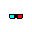
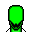

# Layers in /deathofkevin

By image format (mime type):
- image/png _(81)_

**0** -  Yellow Crazy · Pink Crazy · Teal Crazy · Pink · Yellow · Teal · None  _(7)_  
 
 
 
 
 
 
 

**1** -  Flames · Blitmap Hat · Flies · Quixote Hat · Cheese Head · Monkey Hat · E Girl Hair · Sun Wukong · Floppy Hat · Faustian · Third Eye · Balapa Hat · Clown Hair · Arrow · Leather Bandana · Hungry Fish · None · Brain Full · Brain  _(19)_  
 
 
 
 
 
 
 
 
 
 
 
 
 
 
 
 
 
 
 

**2** -  Rainbow · Pipe · Tongue Out · Cigar · Cigarette · Toothpick · None  _(7)_  
 
 
 
 
 
 
 

**3** -  Mf Doom · Deal With It · Nouns · Luchadores · Led Rip · Robocop · Kongz Rainbow · Groucho · Hacker Heart Eyes · Marylin · Heart Eyes · Glasses Red · Sun Glasses Blue · 3 D Glasses · Glasses Teal · None · Sun Glasses Black  _(17)_  
 
 
 
 
 
 
 
 
 
 
 
 
 
 
 
 
 

**4** -  Black · Skull · Beedy · Beedy Red · Beedy Bold · Derpy Red · Derpy  _(7)_  
 
 
 
 
 
 
 

**5** -  Skull · Holes · Upturned · Droopy · Downturned  _(5)_  
 
 
 
 
 

**6** -  White · Soft Stripes · Middle Stripes · Light Stripes · Dark Stripes · 60% · 40% · 20% · 10%  _(9)_  
 
 
 
 
 
 
 
 
 

**7** -  1337 · Dead Pixels · Dead  _(3)_  
 
 
 

**8** -  Sun · Bricks · Gras · White · 90 · 80 · 70  _(7)_  
 
 
 
 
 
 
 

