# Layers in /gatekeepers

By image format (mime type):
- image/png _(226)_

**0** -  Scout · Juggernaut Omega · Juggernaut · Infantry · Spec Ops · Heavy Assault · Demolitions · APE BOT · Phunk-3PO · Skelly BOT · Phender · Light Assault · Terminator · None  _(14)_  
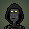 
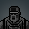 
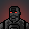 
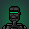 
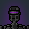 
 
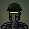 
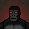 
 
 
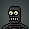 
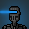 
 
 

**1** -  Juggernaut-ELITE · Terminator-ELITE · Heavy Assault-ELITE · Infantry-ELITE · Scout-ELITE · Spec Ops-ELITE · Demolitions-ELITE · Light Assault-ELITE · Alien · Ape · Yeti · Alien · Yeti · Ape · Zombie · Ape · Ape · Ape · Ape · Ape · Ape · Ape · Ape · Zombie · Gold · No · No · No · No  _(29)_  
 
 
 
 
 
 
 
 
 
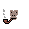 
 
 
 
 
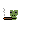 
 
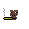 
 
 
 
 
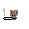 
 
 
 
 
 
 
 

**2** -  Juggernaut-ELITE · Terminator-ELITE · Heavy Assault-ELITE · Infantry-ELITE · Scout-ELITE · Spec Ops-ELITE · Demolitions-ELITE · Light Assault-ELITE · None · 0x-R2 · 0x-R6 · 0x-R8 · Bounty Hunter · Bounty Hunter · Red · Spectrum · Yellow · VR · Laser Vision · Night Vision · Tri-Optics v1 · Tri-Optics v2 · Scope · 2048 Sensor · Grey Shield · Grey · Anti-Glare v2 · Phunk · Thermal · Drowsy · Anti-Glare v1 · Infrared · Uni-Optics · Origins Visor · Leer · Bot · Black Shield · Yellow · Blue · Red Shield · Grey Visor · Yellow Visor · Green Visor · Green · Black Visor · Blue Visor · Red · Red Visor  _(48)_  
 
 
 
 
 
 
 
 
 
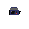 
 
 
 
 
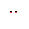 
 
 
 
 
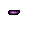 
 
 
 
 
 
 
 
 
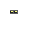 
 
 
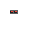 
 
 
 
 
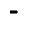 
 
 
 
 
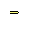 
 
 
 
 
 
 

**3** -  Juggernaut-ELITE · Terminator-ELITE · Heavy Assault-ELITE · Infantry-ELITE · Scout-ELITE · Spec Ops-ELITE · Demolitions-ELITE · Light Assault-ELITE · R-Series · Tungsten Blast Hoodie · Chromium Blast Hoodie · Blast Cap · Titanium Blast Hoodie · Bandana · Head Light · Welded Cap · Durag · Antenna · None  _(19)_  
 
 
 
 
 
 
 
 
 
 
 
 
 
 
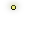 
 
 
 
 

**4** -  0xM45K-002 · 0xM45K-001 · Juggernaut-ELITE · Terminator-ELITE · Heavy Assault-ELITE · Infantry-ELITE · Scout-ELITE · Spec Ops-ELITE · Demolitions-ELITE · Light Assault-ELITE · 0xTiChTu-001 · 0xTuChTi-001 · 0xTuTi-001 · 0xChTi-001 · 0xTuCh-001 · 0xCh-002 · 0xTi-001 · 0xTi-003 · 0xTi-002 · 0xTu-002 · 0xTi-004 · 0xTu-003 · 0xTu-004 · 0xCh-001 · 0xTu-001 · 0xCH-004 · 0xCH-003 · None  _(28)_  
 
 
 
 
 
 
 
 
 
 
 
 
 
 
 
 
 
 
 
 
 
 
 
 
 
 
 
 

**5** -  Juggernaut-ELITE · Terminator-ELITE · Heavy Assault-ELITE · Infantry-ELITE · Scout-ELITE · Spec Ops-ELITE · Demolitions-ELITE · Light Assault-ELITE · 0xC4G3-Tu-003 · 0xC4G3-Tu-002 · 0xC4G3-Ti-001 · 0xV3NT-002 · 0xG4T3-001 · 0xG4T3-002 · 0xGR1D-Ti-001 · 0xGR1D-Ch-001 · 0xV3NT-001 · 0xT33-Tu-001 · 0xT33-Tu-002 · 0xP0RT-001 · 0xC4G3-Tu-001 · 0xV3NT-003 · 0xP0RTed-001 · 0xP0RT-Ti-003 · 0xP0RT-Ti-002 · 0xP0RT-Ti-004 · 0xP0RT-Ch-001 · 0xP0RT-Ti-001  _(28)_  
 
 
 
 
 
 
 
 
 
 
 
 
 
 
 
 
 
 
 
 
 
 
 
 
 
 
 
 

**6** -  Juggernaut-ELITE · Terminator-ELITE · Heavy Assault-ELITE · Infantry-ELITE · Scout-ELITE · Spec Ops-ELITE · Demolitions-ELITE · Light Assault-ELITE · None · 0x-BU11-003 · 0x-T33-006 · 0x-T33-005 · 0x-T33-004 · 0x-TR1B4L-003 · 0x-V3NT-003 · 0x-V3NT-002 · 0x-TR1B4L-001 · 0x-L1N3-002 · 0x-BU11-002 · 0x-L1N3-001 · 0x-TD0T-002 · 0x-5TR1P3-003 · 0x-TR1B4L-002 · 0x-TD0T-001 · 0x-BU11-001 · 0x-F0RK-002 · 0x-T33-003 · 0x-5TR1P3-002 · 0x-F0RK-001 · 0x-T33-002 · 0x-B10CK-002 · 0x-T33-001 · 0x-V3NT-001 · 0x-5TR1P3-001 · 0x-B10CK-001  _(35)_  
 
 
 
 
 
 
 
 
 
 
 
 
 
 
 
 
 
 
 
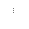 
 
 
 
 
 
 
 
 
 
 
 
 
 
 
 

**7** -  Infantry · Light Assault · Heavy Assault · Scout · Demolitions · Spec Ops · Juggernaut · Terminator · Terminator · Terminator · Spec Ops · Demolitions · Juggernaut · Scout · Heavy Assault · Light Assault · Infantry  _(17)_  
 
 
 
 
 
 
 
 
 
 
 
 
 
 
 
 
 

**8** -  ELITE · Base v1 · Base v2  _(3)_  
 
 
 

**9** -  ELITE · Nightfall · Dusk · Twilight · Dawn  _(5)_  
 
 
 
 
 

