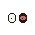

# Layers in /grimmers

By image format (mime type):
- image/png _(73)_

**0** -  Haha · Hidden  _(2)_  
 
 

**1** -  1/1 · Lasers · Reptile · Eye Patch · Drowsy · High · Blood Shot · Crying · White · Hollow · Side Eye · Black Eye · Spooked  _(13)_  
 
 
 
 
 
 
 
 
 
 
 
 
 

**2** -  1/1 · Nurse · Arrow · Headphones · Sweat Band · Curl · Hoodie · Antennae · Skunk · Horns · Halo · Crown · Cowboy Hat · Top Hat · Balding · Widows Peak · Long · Afro · Short · Mohawk · Bob · None  _(22)_  
 
 
 
 
 
 
 
 
 
 
 
 
 
 
 
 
 
 
 
 
 
 

**3** -  1/1 · Small · Droopy · Pointy · Holes · Big  _(6)_  
 
 
 
 
 
 

**4** -  1/1 · Blush · Glow · None · Lashes  _(5)_  
 
 
 
 
 

**5** -  1/1 · Smile · Stitched · Blood · Vampire · Baby · Skull · Shook · Lips · Meh  _(10)_  
 
 
 
 
 
 
 
 
 
 

**6** -  1/1 · Severed Head · Suit · Choker · Diamond · Hair · None · Jacket · Turtle  _(9)_  
 
 
 
 
 
 
 
 
 

**7** -  1/1 · Skeleton · Zombie · Dark · Light  _(5)_  
 
 
 
 
 

**8** -  Light  _(1)_  
 

