# Layers in /madmasks

**0** -  Mega Minister · Mega Masker · Mega Mage · Mega Magistrate · Mega Mapper · Mega Matchmaker · Mega Medic · Mega Machinist · Mega Member · Mega Mercenary · Mega Merchant · Mega Miner · None  _(13)_  
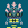 
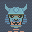 
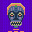 
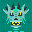 
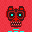 
 
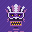 
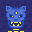 
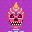 
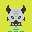 
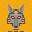 
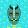 
 

**1** -  Blank · Stim Pack · Sparkle · Parasite · 3D Glasses · Space Helmet · Augmented · Noggles Pink · Noggles Cyan · Decay · Pipe · Medallion · Chrome · Crown · Cigar · None  _(16)_  
 
 
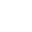 
 
 
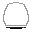 
 
 
 
 
 
 
 
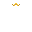 
 
 

**2** -  Blank · Machinist Ancient · Machinist Neutral · Machinist Pop · Mage Ancient · Mage Neutral · Mage Pop · Magistrate Ancient · Magistrate Neutral · Magistrate Pop · Mapper Ancient · Mapper Neutral · Mapper Pop · Masker Ancient · Masker Neutral · Masker Pop · Matchmaker Ancient · Matchmaker Neutral · Matchmaker Pop · Medic Ancient · Medic Neutral · Medic Pop · Member Ancient · Member Neutral · Member Pop · Mercenary Ancient · Mercenary Neutral · Mercenary Pop · Merchant Ancient · Merchant Neutral · Merchant Pop · Miner Ancient · Miner Neutral · Miner Pop · Minister Ancient · Minister Neutral · Minister Pop · Machinist · Mage · Magistrate · Mapper · Matchmaker · Medic · Member · Mercenary · Merchant · Miner · Minister · Masker  _(49)_  
 
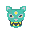 
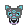 
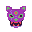 
 
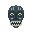 
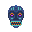 
 
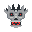 
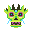 
 
 
 
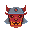 
 
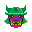 
 
 
 
 
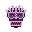 
 
 
 
 
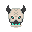 
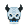 
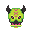 
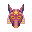 
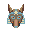 
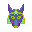 
 
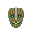 
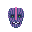 
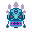 
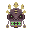 
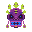 
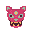 
 
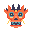 
 
 
 
 
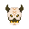 
 
 
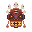 
 

**3** -  Blank · Turtleneck · Armor · Medallion · Shield · Bowtie · Collar · Choker · Amulet · None  _(10)_  
 
 
 
 
 
 
 
 
 
 

**4** -  Blank · Red Bones · Black Bones · Red · Yellow · Pink · White · Seafoam · Orange · Cobalt · Green · Blue · Grey · Purple · Black  _(15)_  
 
 
 
 
 
 
 
 
 
 
 
 
 
 
 

**5** -  Blank · MM · PP · 010 · XF · XY · XX  _(7)_  
 
 
 
 
 
 
 

**6** -  Blank · Emergence · Exo · Wings · Swords · Jetpack · Hoodie · None  _(8)_  
 
 
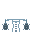 
 
 
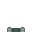 
 
 

**7** -  Blank · Text · Bluechip · Portal · ZigZag · Swarm · Aura · Morse · Dust · None  _(10)_  
 
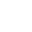 
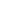 
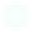 
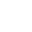 
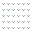 
 
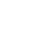 
 
 

**8** -  Blank · Chain · Fidenza · Pattern · Modern · Rainbow · Stars · Stripes · Birch · Soda · Dark Mode · Grey · Lavender · Sand · Yellow · Rose · Orange · Grapefruit · Lime · Green · Teal · Blueish · Blue  _(23)_  
 
 
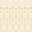 
 
 
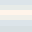 
 
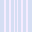 
 
 
 
 
 
 
 
 
 
 
 
 
 
 
 

