# Layers in /novo

By image format (mime type):
- image/png _(37)_

**0** -  Nouns · Red · Glasses · Orange · Blue · White · Dark · Novo  _(8)_  
 
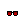 
 
 
 
 
 
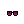 

**1** -  Fire · Dark · Brown · Red · Blue · Novo  _(6)_  
 
 
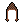 
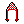 
 
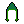 

**2** -  Apple · Medical Mask · None  _(3)_  
 
 
 

**3** -  Skeleton · Alien · Zombie · Ape · Novo  _(5)_  
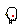 
 
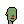 
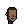 
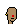 

**4** -  Bookshelf · Chalkboard · Warp Speed · Sun · Punk · Wildblonde · Headband · 3D · Pinkwave · Purple · Peach · Red · Orange · Green · Novo  _(15)_  
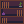 
 
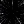 
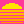 
 
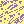 
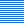 
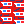 
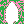 
 
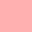 
 
 
 
 

