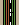
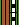
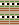
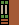
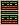
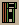

# Layers in /pepeblocks

By image format (mime type):
- image/png _(100)_

**0** -  Pepe · Pepe · Pepe · Pepe · Pepe · Pepe · Pepe · Pepe · Pepe · Pepe · Pepe · Pepe · Pepe · Pepe · Pepe · Pepe · Pepe · Pepe · Pepe · Pepe · Pepe · Pepe · Pepe · Pepe · Pepe · Pepe · Pepe · Pepe · Pepe · Pepe · Pepe · Pepe · Pepe · Pepe · Pepe · Pepe · Pepe · Pepe · Pepe · Pepe · Pepe · Pepe · Pepe · Pepe · Pepe · Pepe · Pepe · Pepe · Pepe · Pepe · Pepe · Pepe · Pepe · Pepe · Pepe · Pepe · Pepe · Pepe · Pepe · Pepe · Pepe · Pepe · Pepe · Mega Pepe 1/4 · Mega Pepe 2/4 · Mega Pepe 3/4 · Mega Pepe 4/4 · Pepe · Pepe · Pepe · Pepe · Pepe · Pepe · Pepe · Pepe · Pepe · Pepe · Pepe · Pepe · Pepe · Pepe · Pepe · Pepe · Pepe · Pepe · Pepe · Pepe · Pepe · Pepe · Fat Pepe 1/2 · Fat Pepe 2/2 · Pepe · Pepe · Pepe · Pepe · Pepe · Pepe · Pepe · Pepe · Pepe  _(100)_  
 
 
 
 
 
 
 
 
 
 
 
 
 
 
 
 
 
 
 
 
 
 
 
 
 
 
 
 
 
 
 
 
 
 
 
 
 
 
 
 
 
 
 
 
 
 
 
 
 
 
 
 
 
 
 
 
 
 
 
 
 
 
 
 
 
 
 
 
 
 
 
 
 
 
 
 
 
 
 
 
 
 
 
 
 
 
 
 
 
 
 
 
 
 
 
 
 
 
 
 

