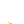

# Layers in /shiba

By image format (mime type):
- image/png _(126)_

**0** -  Gold Collar · Diamond Necklace · Platinum Chain · Gold Chain · Choke Collar · Pearl Necklace · Silver Chain · Brown Collar · Black Collar · Blue Collar · Red Collar · White Collar · Grey Collar · None  _(14)_  
 
 
 
 
 
 
 
 
 
 
 
 
 
 

**1** -  Designer 'Bows · Welding Goggles · Gold Shades · VR · Blue Nouns · Green Nouns · Snowboarding Goggles · Designer · Puppy Dog · Toonz · Fancy Shades · Red · Eye Patch · Eye Mask · Clear · Non-prescription Clear Glasses · Silver Shades · Big Shades Prune · Silver Prescription Glasses · Black Prescription Glasses · Big Shades Forest · Nerd Glasses · Café Cuties · Low Pros · OG Shades · Grey Shades · Classic Shades · Sport Shades · None  _(29)_  
 
 
 
 
 
 
 
 
 
 
 
 
 
 
 
 
 
 
 
 
 
 
 
 
 
 
 
 
 

**2** -  Rose Wood Pipe · Bubble Gum · Cigar · Oak Wood Pipe · Blunt · Vape · Stick · Bone · Cigarette · Joint · Twig · Tongue · Grin · Smirk · None  _(15)_  
 
 
 
 
 
 
 
 
 
 
 
 
 
 
 

**3** -  Blue Snapback w/ Bandana · White Snapback w/ Bandana · Blue Snapback w/ Bandana · Crown · White Cowboy Hat · White Snapback w/ Bandana · Grey Cowboy Hat · Blue Snapback w/ Bandana · ALPHA · White Snapback w/ Bandana · White Cowboy Hat · Grey Cowboy Hat · Teddy · Lil' Red Riding Hood · Beanie · Hachimaki · Fawn · White Hoodie · Calf · Grey Hoodie · Top Hat · Broad Ears · Blue Snapback · Pilot Goggles · Grey Fedora · Adventurer Hat · White Snapback · Bowler Hat · Purple Bucket Hat · Brown Fedora · Pointy Ears · White Bucket Hat · Dark Grey Durag · Light Grey Durag · Red Headband · Blue Headband · Blue Bandana · Green Knitted Cap · Red Bandana · Brown Knitted Cap · Red Knitted Cap · Black Bandana · Grey Bandana · None  _(44)_  
 
 
 
 
 
 
 
 
 
 
 
 
 
 
 
 
 
 
 
 
 
 
 
 
 
 
 
 
 
 
 
 
 
 
 
 
 
 
 
 
 
 
 
 

**4** -  Diamond · Platinum · Gold · Pearl · Silver · None  _(6)_  
 
 
 
 
 
 

**5** -  Alien · Digital · Geometric · Gold · Zombie · Albino · Stray · Toffee · Cream · Coffee · Black · Red · Beige · Brown · Sesame · Golden Brown · Orange  _(17)_  
 
 
 
 
 
 
 
 
 
 
 
 
 
 
 
 
 

**6** -  Blue  _(1)_  
 

