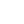
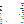

# Layers in /smiley

**0** -  Clown · nose nose · round · long · snub  _(5)_  
 
 
 
 
 

**1** -  laser eyes · red nouns glasses · Cyborg · White sunnies · Glitch eyes · nouns eyes · big eyes · Bloodshot · Square inverse · Toadz eyes · blue nouns · Square · 3D glasses · green nouns glasses · pirate patch · sunnies · sunnies · Square glitch · Blue eyes · Normal  _(20)_  
 
 
 
 
 
 
 
 
 
 
 
 
 
 
 
 
 
 
 
 

**2** -  rainbow · Blushing · freckles · Red · Pink · Flashing · none  _(7)_  
 
 
 
 
 
 
 

**3** -  cigar · dribble · Pill · Rainbow · Tongue Poke · none  _(6)_  
 
 
 
 
 
 

**4** -  Bright yellow smiley · panda smiley · skelly · stripey animated · Squish · stripey · Smiley  _(7)_  
 
 
 
 
 
 
 

**5** -   ·  · none  _(3)_  
 
 
 

**6** -  sun rays · glitch · bad TV · stars · levels · None  _(6)_  
 
 
 
 
 
 

**7** -  Blue · Pink · Smiley yellow · Bright yellow  _(4)_  
 
 
 
 

