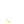
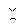

# Layers in /nomads

By image format (mime type):
- image/png _(65)_

**0** -  Leading Scientist · Watermelon Emoji x 3 · Not Elite  _(3)_  
 
 
 

**1** -  devs caught sleeping · Flexin That Nomad Money · Beanie Orhcestrated This · Nomad Hunter · You Are Fucked Mate · Jacked in for The Hack · Clown Hair aka. Nomad hair · Basement Dwellin · slurrrp · these glasses will disguise my public ens right · Vape · Smoking · Held Ransom · Pipe · how could the SEC let this happen? · Horny · Bearded · Strapped In · Malding · Wild Hair · Mohawkin · learn to code next time. nothing for you.  _(22)_  
 
 
 
 
 
 
 
 
 
 
 
 
 
 
 
 
 
 
 
 
 
 

**2** -  Babe Were Moving To Bali · I WILL RETURN THE FUNDS I PROMISE PLS DONT ARREST ME · REEEEEEEEEEEEEEE · I SWEAR I WAS JUST TESTING IT OUT · I AM NOT F ING MAD · REALLY NO MAD · No Really No Mad · No Mad · Just Observing  _(9)_  
 
 
 
 
 
 
 
 
 

**3** -  Laser · Up All Night Draining Funds · Money In Your Eyes · Blue · White · Purple · Green · No Mad Eyes  _(8)_  
 
 
 
 
 
 
 
 

**4** -  Alien · Ape · Zombie · Male 6 · Male 5 · Male 4 · Male 3 · Male 2 · Male 1  _(9)_  
 
 
 
 
 
 
 
 
 

**5** -  Hacking Into The Nomad · Sun · RIP nomad · Straight Hackin · Chain Runners BG 5 · Chain Runners BG 3 · Chain Runners BG 2 · Chain Runners BG 1 · Chain Runners BG 4 · Over the rainbow bridge for nomad bridge · Dark Plain · In the Swamp · Plain 2 · Plain  _(14)_  
 
 
 
 
 
 
 
 
 
 
 
 
 
 

