# Layers in /phunkapeorigins

By image format (mime type):
- image/png _(112)_

**0** -  Cigar · Banana Wrapped Blunt · Pipe · Twig · Canines · Blunt · Tooth · Joint · Vape · None  _(10)_  
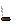 
 
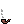 
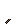 
 
 
 
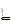 
 
 

**1** -  Diamond Chain · Collar · White Lace · Gash · Gold Chain · Tooth Necklace · Silver Chain · None  _(8)_  
 
 
 
 
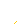 
 
 
 

**2** -  Diamond Dangle · Diamond Stud · Gold Dangle · Gold Stud · Silver Dangle · Tooth Plug · Silver Stud · None  _(8)_  
 
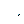 
 
 
 
 
 
 

**3** -  Green Nouns · Pink Nouns · Blue Nouns · VR · Snow Visor · 3D · Blue Visor · Visor · Undead · Gold Aviator · Classic Shades · Big Shades · Matrix Shades · Blue Light Blockers · Silver Aviator · Small Shades · Red · Focused Red · Focused · None  _(20)_  
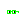 
 
 
 
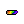 
 
 
 
 
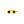 
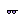 
 
 
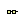 
 
 
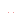 
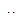 
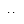 
 

**4** -  Royal Crown · Gold Hoodie · Monkey Skull Band · Overgrown Mushroom · OG Monkey Hat · Beanie · Bone Head · Arrow · Green Bucket Hat · Purple Bucket Hat · Headband · Fedora · Top Hat · Sun Hat · Fast Food Hat · Official Monkey Hat · Apricot Knitted Cap · Peach Knitted Cap · Green Ballcap · Viking Helmet · Clean Hoodie · OG Hoodie · Mushroom · Red Ballcap · Dark Durag · Grey Cap · Wild Monkey Hair · Gash · Brains · Dark Cowboy Hat · Light Durag · Light Cowboy Hat · Bandana · Grey Trucker Hat · Clean Trucker Hat · Crazy Monkey Hair · Wise Monkey Hair · Stray Hair · Coat Shine · None  _(40)_  
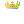 
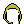 
 
 
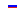 
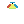 
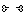 
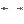 
 
 
 
 
 
 
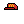 
 
 
 
 
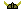 
 
 
 
 
 
 
 
 
 
 
 
 
 
 
 
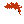 
 
 
 
 

**5** -  Alien · Yeti · Rainbow · Zombie · Gold · Bonobo · Silver Back · Orangutan · Gibbon · Baboon · Chimpanzee 2 · Chimpanzee 1 · Chimpanzee 3  _(13)_  
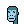 
 
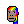 
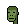 
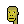 
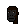 
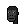 
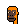 
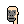 
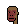 
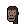 
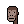 
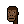 

**6** -  Blue 2 · Blue 1 · Blue 3 · Blue 4 · Blue 5  _(5)_  
 
 
 
 
 

**7** -  Unknown · Sahelanthropus Tchadensis · Orrorin Tugenensis · Ardipithecus Kadabba · Ardipithecus Ramidus · Australopithecus Africanus · Paranthropus · Australopithecus Sediba  _(8)_  
 
 
 
 
 
 
 
 

